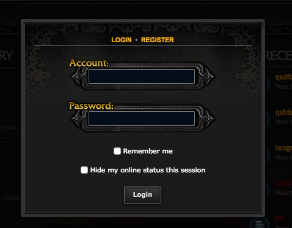

Quick Login for phpBB 3.2
=========================

Extension for phpBB 3.2 that adds a simple quick login popup lightbox using JavaScript.

#### Version
v1.1.3 (25/07/2020) 

#### Support
- [Support forum](http://www.avathar.be/forum/viewforum.php?f=65)

## Features
- A simple lightbox popup for quick login actions.
- Changes the behaviour of the normal login button in the header.
- Only activates on pages where there is no normal login form (not when trying to access the UCP for example).

#### Requirements
- phpBB 3.2.0 or higher

#### Languages supported
- No language files included/necessary
- for pbWoW3, en, es, fr, de, ru are supported. 

#### Styles supported
- Prosilver derived styles
- pbWoW3.2 

## Installation
1. [Download the latest release](https://github.com/Sajaki/QuickLogin/releases) and unzip it.
2. Copy the entire contents from the unzipped folder to `/ext/paybas/quicklogin/`.
3. Navigate in the ACP to `Customise -> Manage extensions`.
4. Find `Quick Login` under "Disabled Extensions" and click `Enable`.

## Uninstallation
1. Navigate in the ACP to `Customise -> Manage extensions`.
2. Click the `Disable` link for `Quick Login`.
3. To permanently uninstall, click `Delete Data`, then delete the `quicklogin` folder from `/ext/paybas/`.

### License
[GNU General Public License v2](http://opensource.org/licenses/GPL-2.0)

© 2015 - PayBas
© 2017 - Sajaki
